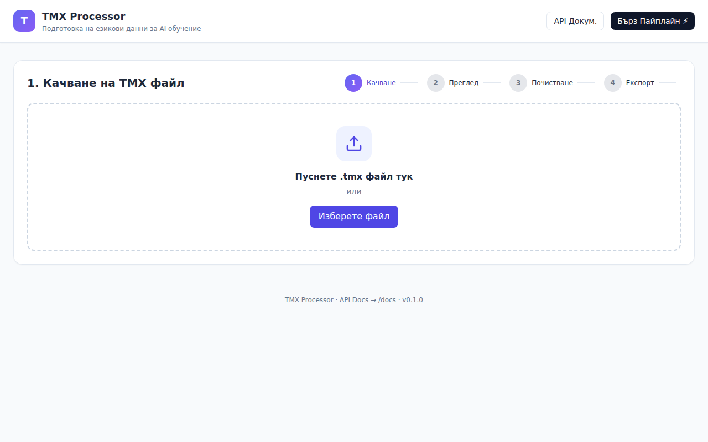
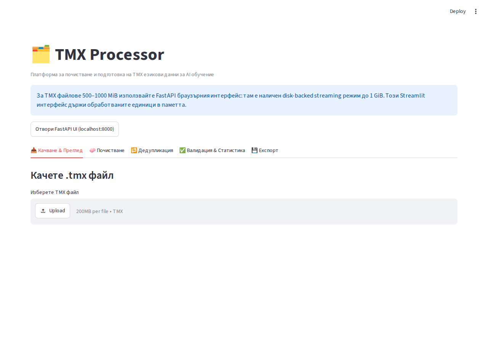

# TMX Processor — Пълна документация на български език

Добре дошли в официалната документация на **TMX Processor** — професионална платформа за обработка, почистване, валидация, дедупликация и конвертиране на TMX (Translation Memory eXchange) езикови файлове за обучение на AI модели (LLM, машинен превод, fine-tuning).

---

## 📚 Съдържание на документацията

Документацията е разделена на тематични раздели за бърз и удобен достъп:

1. [🚀 Инсталация и Конфигурация](02_INSTALLATION.md)
   - Изисквания, създаване на виртуална среда, инсталация на пакета и незадължителни зависимости.
2. [📥 Парсване и Многоезичност](03_PARSER_AND_MULTILINGUAL.md)
   - XML iterparse стрийминг, откриване на налични езици, филтриране по езикови двойки и експлозия на мултиезични TMX файлове.
3. [🧹 Почистване и PII Анонимизиране](04_CLEANING_AND_ANONYMIZATION.md)
   - Unicode нормализация, HTML/URL премахване, запазване на placeholders, PII Redactor (маскиране на лични данни).
4. [✅ Валидация и Quality Scoring](05_VALIDATION_AND_QUALITY.md)
   - Оценка за качество (0.0–100.0), проверки за несъответствие на числа, праг за шум и проверка за азбука/скрипт (напр. латиница в BG/RU).
5. [🗑️ Дедупликация и Пакетна обработка](06_DEDUPLICATION_AND_BATCH.md)
   - Exact и MinHash LSH fuzzy дедупликация, диск-базиран SQLite хранилищен режим и мулти-процесорно паралелно изпълнение (`BatchProcessor`).
6. [📊 Статистика, Токени и Терминология](07_ANALYSIS_TERMINOLOGY_TOKENS.md)
   - Токен калкулатор за Llama-3, Qwen, GPT-4 и Mistral, генератор на доклад за готовност за fine-tuning, извличане на терминология и конкордансно търсене.
7. [🔄 Конвертиране и 13 AI Формата](08_CONVERSION_AND_AI_FORMATS.md)
   - Поддръжка на JSONL, Parquet, CSV, TSV, JSON, Alpaca, ShareGPT, ChatML, OpenAI, DPO/ORPO, Prompt/Completion, Reasoning, HuggingFace splits и Context Window Packing.
8. [🖥️ Интерфейси: CLI, FastAPI и Streamlit UI](09_CLI_AND_WEB_INTERFACES.md)
   - Използване през команда линия (`tmx-proc`), REST API (`tmx-web`), FastAPI SPA интерфейс и Streamlit UI.

---

## 🎯 Архитектурен преглед

```
                       ┌─────────────────────────┐
                       │   TMX Файлове (.tmx)    │
                       └────────────┬────────────┘
                                    │
                                    ▼
┌────────────────────────────────────────────────────────────────────────┐
│                          TMXProcessor Core                             │
├─────────────────┬───────────────────┬──────────────────────────────────┤
│ parser.py       │ cleaner.py        │ validator.py                     │
│ - Streamparse   │ - Unicode NFKC    │ - Quality Score (0-100)          │
│ - Lang Discovery│ - PII Redactor    │ - Script Mismatch (Latin/Cyr)    │
├─────────────────┼───────────────────┼──────────────────────────────────┤
│ deduper.py      │ analyzer.py       │ converter.py                     │
│ - Exact SQLite  │ - LLM Token Calc  │ - 13 AI formats                  │
│ - MinHash LSH   │ - Term Extraction │ - Context Window Packing         │
└─────────────────┴─────────┬─────────┴──────────────────────────────────┘
                            │
       ┌────────────────────┼────────────────────┐
       ▼                    ▼                    ▼
┌──────────────┐  ┌──────────────────┐  ┌──────────────────┐
│  CLI Engine  │  │   FastAPI Web    │  │   Streamlit UI   │
│  (tmx-proc)  │  │    (tmx-web)     │  │   (streamlit)    │
└──────────────┘  └──────────────────┘  └──────────────────┘
```

---

## 📸 Галерия с интерфейси

### FastAPI SPA Уеб Интерфейс


### Streamlit UI Интерфейс


---

> За въпроси и обратна връзка ползвайте Issues секцията на репозиторията.
